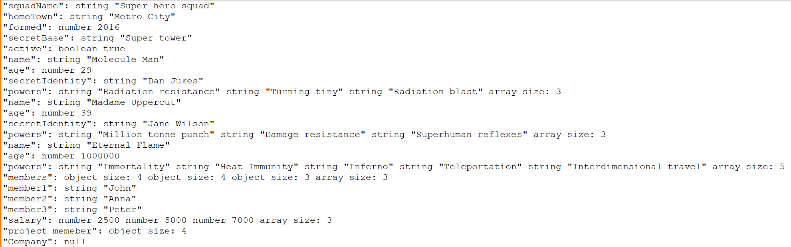
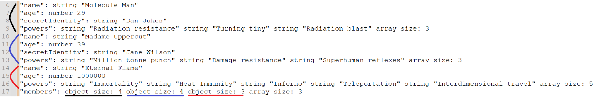

# 編譯器期末專案報告

## 主題: Parse json的檔案將資料的key、value和型態輸出
### <font color=blue size=4>組員及分工: 資工3A 01057020 林佑丞(100%)</font>

## 使用說明
1. 請先安裝flex、bison和wxDevC++
2. 輸入指令(cmd)
```cmd=
flex token.l
bison -d grammer.y
gcc grammer.tab.c lex.yy.c -lfl
a.exe < [jsonfile]
```
3. 若使用powershell，將a.exe < [jsonfile]改成:
```shell=
get-Content [jsonfile] | ./a.exe
```
([jsonfile]請自行改成json檔案的路徑)

## Run

### Input1:
```json
{
  "squadName": "Super hero squad",
  "homeTown": "Metro City",
  "formed": 2016,
  "secretBase": "Super tower",
  "active": true,
  "members": [
    {
      "name": "Molecule Man",
      "age": 29,
      "secretIdentity": "Dan Jukes",
      "powers": ["Radiation resistance", "Turning tiny", "Radiation blast"]
    },
    {
      "name": "Madame Uppercut",
      "age": 39,
      "secretIdentity": "Jane Wilson",
      "powers": [
        "Million tonne punch",
        "Damage resistance",
        "Superhuman reflexes"
      ]
    },
    {
      "name": "Eternal Flame",
      "age": 1000000,
      "powers": [
        "Immortality",
        "Heat Immunity",
        "Inferno",
        "Teleportation",
        "Interdimensional travel"
      ]
    }
  ],
  "project memeber": {
    "member1": "John",
    "member2": "Anna",
    "member3": "Peter",
    "salary": [2500, 5000, 7000]
  },
  "Company": null
}
```
### Output1:




### 輸出說明:
(請參照上方的輸入輸出)
json的資料分為數字、字串、布林、陣列、物件及null
如果是字串、數字、布林及null
輸出為: "key": type value
ex:
```
"squadName": string "Super hero squad"
"formed": number 2016
"active": boolean true
"Company": null
```
如果是陣列
則會將陣列的內容輸出再輸出類型及大小
ex:
```
"powers": string "Million tonne punch" string "Damage resistance" string "Superhuman reflexes" array size: 3
```
若為物件:
則會先輸出內容物，再輸出key和類型及大小
ex:
```
"member1": string "John"
"member2": string "Anna"
"member3": string "Peter"
"salary": number 2500 number 5000 number 7000 array size: 3
"project memeber": object size: 4
```
陣列內為物件則為下圖


顏色為對應的物件內容
members是有三個物件類型的陣列

<div style="page-break-after:always"></div>

## 發生錯誤
只要讀入的json檔案不是合法的，就會顯示錯誤訊息並終止輸出
ex:
input:
```json
{
  "squadName": "Super hero squad
}
```
output:


input的內容最後少了一個"，所以他是不合法的json檔案，故發生syntax error
